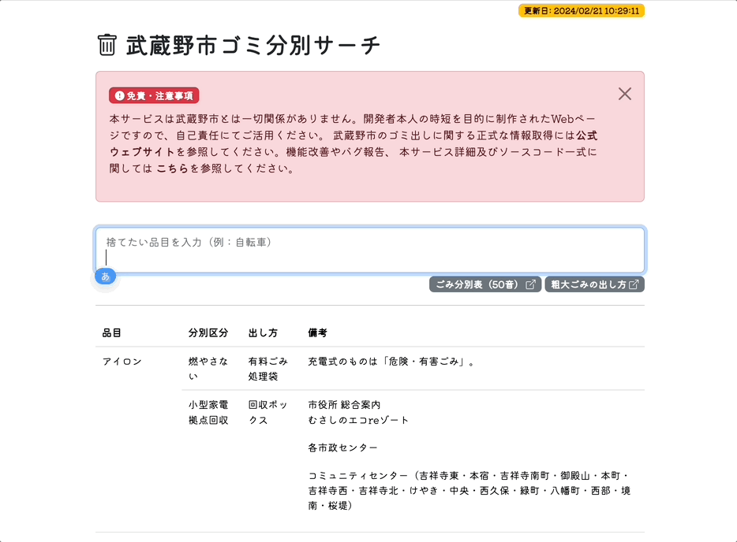

# bunbetsuable



## 使い方
以下のURLをpcやスマホでbookmarkして、ゴミの廃棄方法を調べるときにアクセスしてください。
  * https://tetsuakibaba.github.io/bunbetsuable/

## 開発
武蔵野市のWebサーバへのアクセス配慮から、直接武蔵野市のWebサーバに対して動的にスクレイピングは行っていません。こちらのリポジトリを活用してご自身で開発・拡張される場合はその点ご留意ください。武蔵野ウェブサイトから直接スクレイピングを行いたい場合はget.js内のソースコードを参照してください。CORSポリシー, javascriptで実行することをおすすめします。

### ごみ分別情報の更新
武蔵野市が不定期にごみ分別情報を更新するため、ごみ情報の更新が必要な場合は以下のコマンドを実行してください。該当するウェブページにアクセスし、htmlファイルをcacheディレクトリに保存します。
```
bash updateCache.sh
```
cache内には武蔵野市のWebサイトのごみ分別情報がhtml形式で保存されています。


## 制作背景
武蔵野市のゴミ分別が使い勝手がわるいので、キーワードを入れたら即時候補がでるようにしました。

以前は<a href="http://www.city.musashino.lg.jp/kurashi_guide/gomi_kankyou_eisei/gomi_dashikata/1004783.html" target="_blank">武蔵野市ごみアプリ</a>で簡単に捨てたいもの検索ができたのですが、アプリの公開終了に伴い武蔵野市公式LINEに情報提供方式が集約されました。しかしながらゴミ分別に関しては多ステップ後に50音順のウェブサイトに飛ばされてしまうため、従来のようなユーザビリティが維持できていないと感じています。一覧に集約されたpdfも配布されているので、そちらから文字列検索をかけることで同様の機能を一部実現できますが、単純なpdf内文字列検索では不要な情報も見えてしまうため視認性が落ちるだけでなく、pdfを開き、テキスト検索をかけるという余計な作業ステップが生じてしまいます。

以上の理由からこのリポジトリでは、以前の武蔵野ごみアプリのように手軽に廃棄するゴミの方法を検索するために実装しました。もし認識が誤っていたらissueに指摘を下さい。

類似サービスにgomisaku.jp というものがありますので、すでに自治体がこのサービスを利用していれば同様の機能を実現できます。ただし私の環境ではページ読み込みに膨大な時間がかかるだけでなく、場合によってはタイムアウトになるため（2021年12月26日現在）、あんまり実用的じゃないなと感じています。むしろフレームワークをオープンソース化してDXを図ったほうが継続可能だなと。

今回は武蔵野ウェブサイトのテーブル構成を読めるようにしてありますが、いっそのこと自治体がcsvで提供してくれれば嬉しいですね。